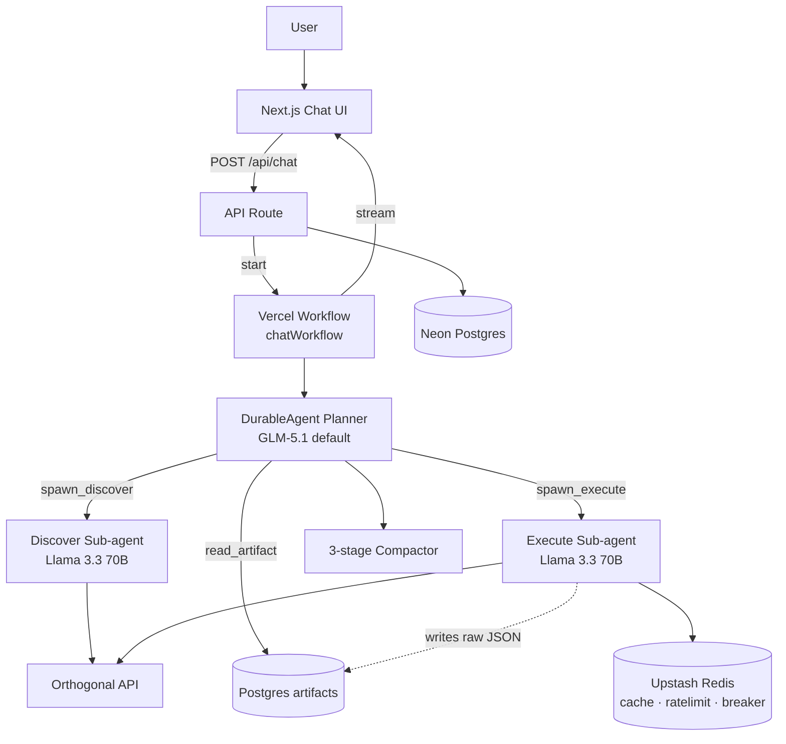
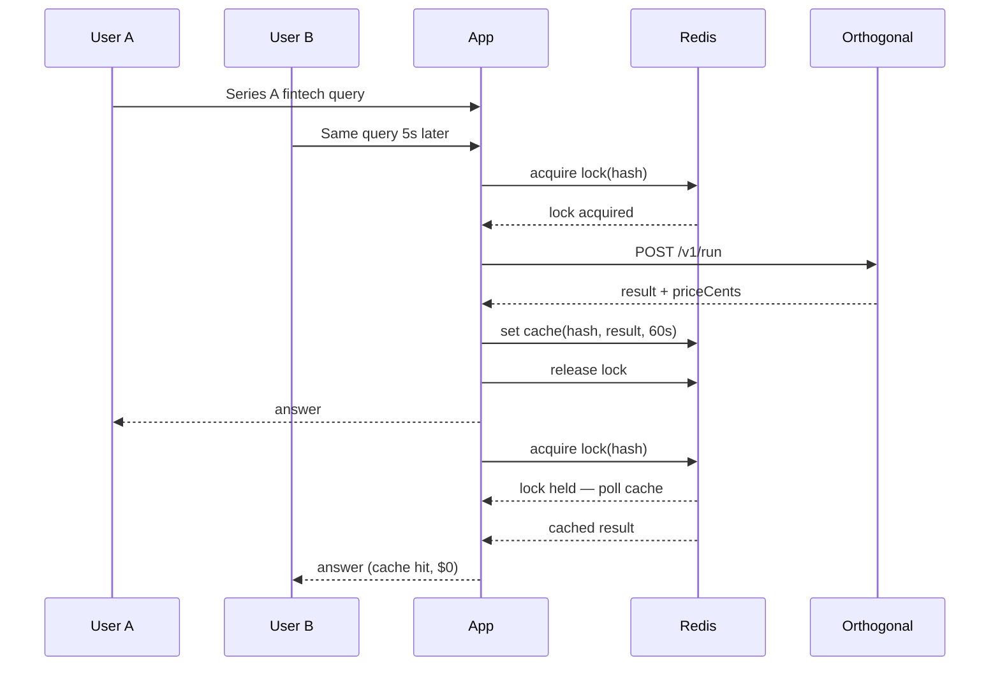

# Orthogonal Chat

A multi-agent AI chat application that calls **Orthogonal's unified API** to return real company, funding, contact, and web data. Built for the Orthogonal engineering take-home.

**Live URL:** [https://orthogonal-chat-rouge.vercel.app](https://orthogonal-chat-rouge.vercel.app)

**Stack:** Next.js 16 · Vercel Workflow DevKit · AI SDK v6 · Together AI · Neon Postgres · Upstash Redis

---

## Quick start

```bash
cd orthogonal-chat
cp .env.example .env.local
# Fill in TOGETHER_API_KEY, ORTHOGONAL_API_KEY, DATABASE_URL, UPSTASH_REDIS_*

# Apply schema (Neon SQL editor or psql)
psql $DATABASE_URL -f drizzle/0000_init.sql

npm install
npm run dev
```

Open [http://localhost:3000](http://localhost:3000) — you'll land in a new chat session automatically.

---

## What it does

Ask questions like:

> List companies that recently raised a Series A in fintech

The agent will:

1. **Think** — explain its approach in plain language
2. **Plan** — show Feasibility / Process / Cost / Sample output before paid calls
3. **Discover** — search Orthogonal's catalog (`/v1/search` + `/v1/details`)
4. **Execute** — run the chosen endpoint via `/v1/run`
5. **Answer** — structured tables/lists with sources (`requestId`s)
6. **Follow up** — suggest 4 next questions

Tool calls appear as collapsible pills (`Searched the API catalog ›`, `Called fundable /deals ›`) matching the Orthogonal reference UI.

---

## Architecture



### Multi-agent design

| Agent | Model | Role |
|-------|-------|------|
| **Planner** | User-selected (default GLM-5.1) | Thin orchestrator — plans, delegates, synthesizes final answer |
| **Discover** | Llama 3.3 70B | Finds cheapest correct Orthogonal endpoint via `/search` + `/details` |
| **Execute** | Llama 3.3 70B | Runs `/run`, stores raw payload as artifact, returns summary only |

The planner never sees raw API JSON — only summaries and artifact pointers. This keeps the main context window lean (Anthropic's agents-as-tools pattern).

### Durable execution (Vercel Workflow DevKit)

Agent turns run as **durable workflows**, not single HTTP requests:

- Each sub-agent call is a `"use step"` function — automatic retry on failure, result persisted for replay
- Streaming is decoupled from execution via `getWritable<UIMessageChunk>()`
- Client reconnects via `WorkflowChatTransport` + `/api/chat/[runId]/stream`
- No step budget — agent runs until the task is solved

### Context management

Three-stage compaction (Claude Code style):

| Threshold | Action |
|-----------|--------|
| **60%** | Log compaction snapshot artifact (no mutation) |
| **75%** | Snip stale tool outputs → `[snipped: see artifact art_xyz]` |
| **85%** | Full summarize older turns into `<previous_context>` system note |

Artifacts (>2KB tool results) survive compaction. Planner can `read_artifact(id, jsonpath?)` to pull specific fields back.

### Orthogonal integration

```
search → details → run
```

- **Retry:** `p-retry` 3× exponential + jitter on 429/5xx only; 12s timeout per attempt
- **Single-flight dedup:** Redis lock + body-hash cache (60s TTL) — two users asking the same Series A question share one API call
- **Circuit breaker:** 5 failures in 60s → open 30s → planner tries alternative via re-discovery
- **Rate limits:** Per-session (60/min) + per-endpoint token bucket (Fundable 30/min, Apollo 60/min)

Retry events stream to the UI: `Retrying Fundable… (2/3)`.

---

## System design

### Database choice: Postgres + Redis

| Store | Purpose | Why |
|-------|---------|-----|
| **Neon Postgres** | Chats, messages (JSONB parts), artifacts, tool_calls, api_call_log | Durable, queryable, JSONB for AI SDK message parts |
| **Upstash Redis** | API response cache, single-flight locks, rate limits, circuit breaker state | Sub-ms KV, ephemeral by design |

Postgres can't do sub-ms locking; Redis can't be the primary store. Both are serverless (zero ops).

### Schema

```
sessions → chats → messages (parts JSONB)
                 → artifacts (payload JSONB, never inlined into LLM context)
                 → tool_calls
                 → api_call_log (dedup index on body_hash)
```

Messages use AI SDK v6 `UIMessage.parts` format — text, tool pills, plan cards, retry banners, artifact chips, follow-ups all persist as typed data parts.

### How it scales

| Axis | Bottleneck | Mitigation |
|------|-----------|------------|
| Chat list/history reads | Postgres query latency | Neon read replicas; SWR on client |
| Agent compute | LLM + API latency | Vercel Workflow auto-scales horizontally; stateless per request |
| Orthogonal upstream | Rate limits + cost | Single-flight dedup; per-endpoint token bucket; circuit breaker |
| Token cost | Long conversations | 3-stage compaction; artifact pattern caps per-turn cost |
| Concurrent identical queries | Duplicate API spend | Redis body-hash cache + single-flight lock |

### Concurrency model



Each user has an isolated **session** (anonymous HTTP-only cookie). Sessions own their chats. The shared Orthogonal API key is pooled; dedup is on identical `{api, path, body}` hashes, not on user identity.

### Resilience playbook

| Failure | User sees | Agent behavior |
|---------|-----------|----------------|
| 429 rate limit | "Retrying Fundable… (2/3)" | p-retry with backoff, streams retry event |
| 5xx upstream | Same retry banner | 3 attempts then structured error to planner |
| Circuit open | "Fundable temporarily unavailable" | Planner re-runs discover for alternative endpoint |
| Timeout (12s) | Retry banner | AbortSignal timeout, retry |
| All retries exhausted | Partial answer + limitations | Planner explains what failed, suggests alternatives |
| Insufficient credits (402) | Error in plan card | Planner asks before proceeding |

### Context management deep-dive

Why not just use the full 200K context?

1. **Cost** — every token in context costs money on every turn
2. **Cache locality** — system prompt + tool defs kept verbatim for prefix-cache hits
3. **Quality** — LLMs degrade with very long contexts; summaries preserve decisions, drop noise

Artifact lifecycle:
```
tool result (>2KB) → artifacts table → planner sees one-line pointer
                                    → read_artifact(id, jsonpath) on demand
                                    → survives compaction
```

---

## Models

Five Together AI models, ranked for tool-calling agent loops:

| # | Model | Context | Pricing | Best for |
|---|-------|---------|---------|----------|
| 1 | GLM 5.1 | 200K | $1.40/$4.40 per 1M | Default planner |
| 2 | Kimi K2.6 | 200K | $1.20/$4.50 per 1M | Frontier alt |
| 3 | MiniMax M2.7 | 200K | $0.30/$1.20 per 1M | Best $/perf |
| 4 | Kimi K2.5 | 256K | $0.50/$2.80 per 1M | Deep tool loops |
| 5 | Llama 3.3 70B | 128K | $0.88 flat per 1M | Fast executor |

The model picker shows live context fill (`34K / 200K · 17%`) updated each turn.

---

## Project structure

```
app/
  api/chat/              POST agent stream, GET reconnect stream
  api/chats/             CRUD + message persistence
  chat/[id]/             Chat page
  chat/new/              Create chat + redirect
components/
  chat/                  Message, ToolPill, PlanCard, FollowUps, ModelPicker, ...
  sidebar.tsx
lib/
  agent/                 Planner tools, sub-agents, compactor, models
  orthogonal/            Client, cache, ratelimit, breaker
  db/                    Drizzle schema + queries
  stream/                Data part protocol + emit helpers
workflows/
  chat.ts                Durable workflow (DurableAgent + compaction)
drizzle/
  0000_init.sql          Schema migration
```

---

## Deploy (Vercel)

**Live URL:** [https://orthogonal-chat-rouge.vercel.app](https://orthogonal-chat-rouge.vercel.app)

The app is deployed to Vercel Hobby. Add environment variables in the [Vercel project settings](https://vercel.com/jayavibhavnks-projects/orthogonal-chat/settings/environment-variables) before using chat features (without them, `/chat/new` returns 500):

```bash
vercel link --scope jayavibhavnks-projects
vercel env pull .env.local

# Set in Vercel dashboard:
# TOGETHER_API_KEY, ORTHOGONAL_API_KEY, DATABASE_URL,
# UPSTASH_REDIS_REST_URL, UPSTASH_REDIS_REST_TOKEN

vercel deploy --prod --scope jayavibhavnks-projects
```

Apply `drizzle/0000_init.sql` to your Neon database before first deploy.

Workflow DevKit routes are auto-generated at `/.well-known/workflow/v1/*`.

---

## What I'd do with more time

- **Auth** — magic-link (Clerk/Auth.js) for cross-device history
- **Vector memory** — pgvector embeddings on artifacts for semantic recall across chats
- **Parallel sub-agents** — fan-out discover+execute concurrently (Anthropic research-system pattern)
- **Planner self-eval** — "did I actually answer the question?" loop before finishing
- **Observability** — Langfuse trace tree + per-call cost dashboard
- **MCP toggle** — switch tool source between REST and `mcp.orth.sh`
- **Rich tables** — TanStack Table for sortable/filterable/CSV-exportable results
- **Budget controls** — per-chat daily cap, planner asks before expensive calls

---

## Environment variables

| Variable | Required | Description |
|----------|----------|-------------|
| `TOGETHER_API_KEY` | Yes | Together AI API key |
| `ORTHOGONAL_API_KEY` | Yes | Orthogonal API key (`orth_live_…`) |
| `DATABASE_URL` | Yes | Neon Postgres connection string |
| `UPSTASH_REDIS_REST_URL` | Recommended | Upstash Redis REST URL |
| `UPSTASH_REDIS_REST_TOKEN` | Recommended | Upstash Redis REST token |

Redis is optional for local dev (cache/rate-limit gracefully degrade) but required for production dedup and concurrency features.
