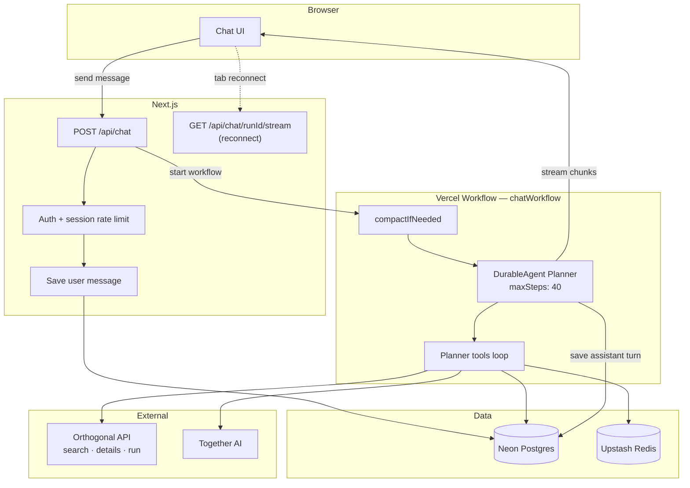
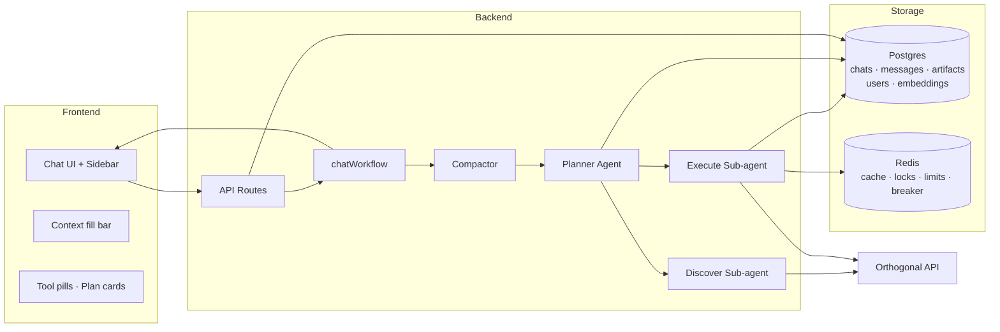
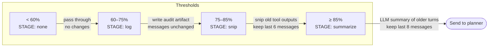
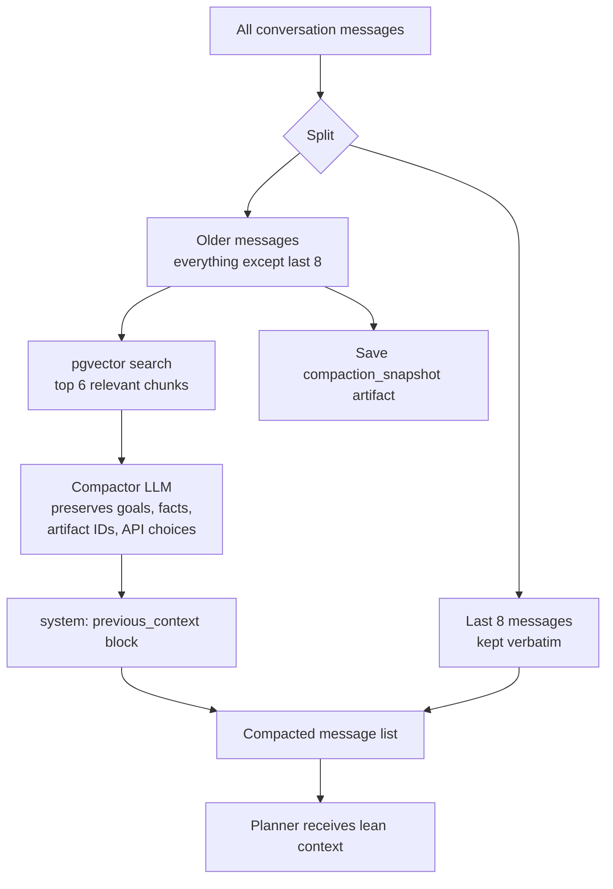
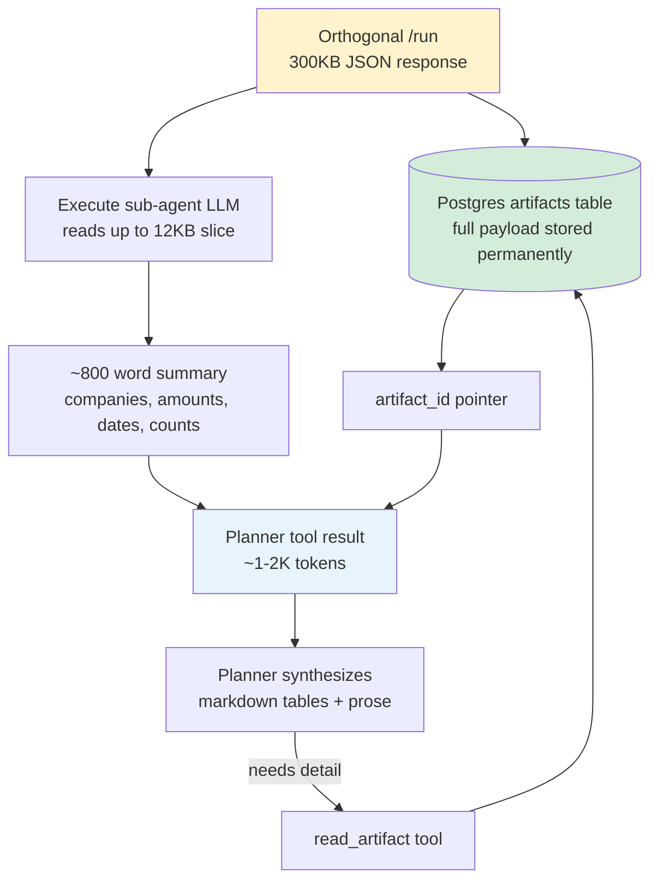
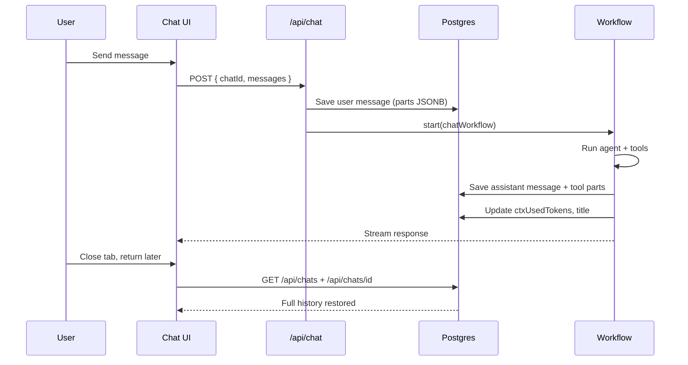
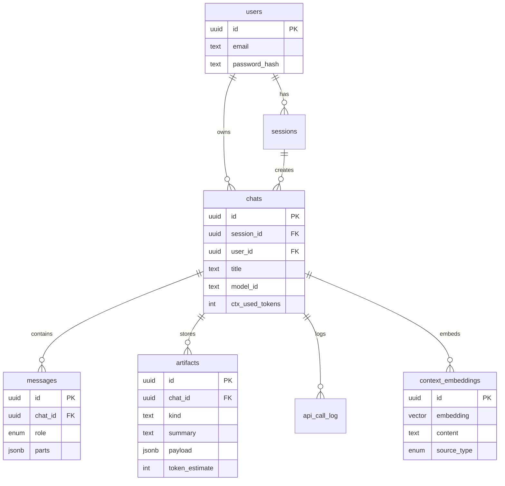
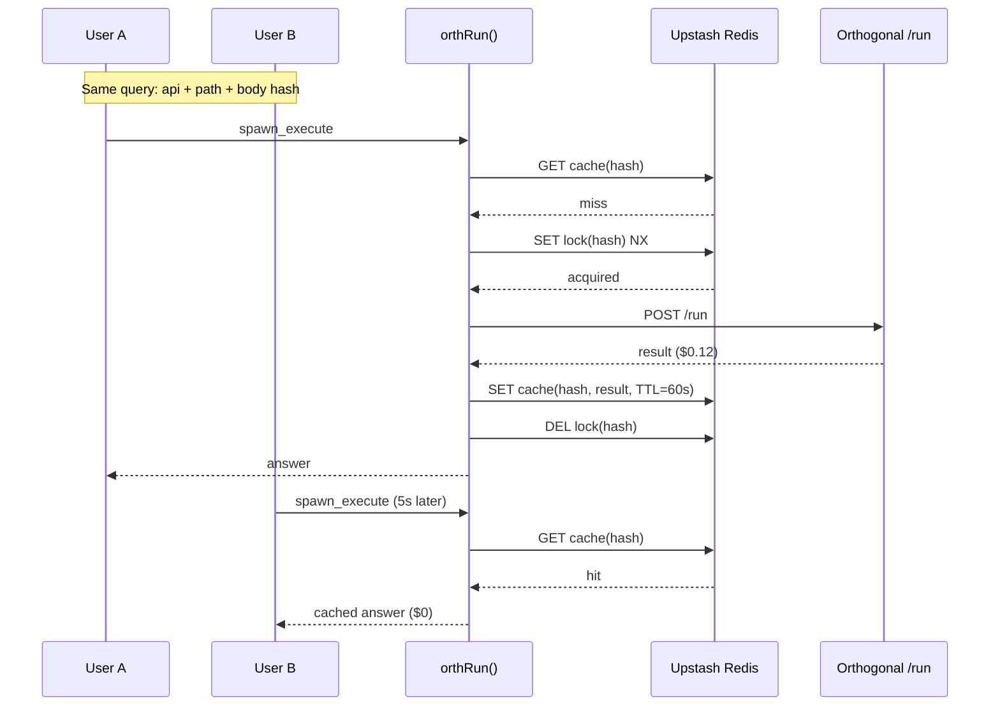
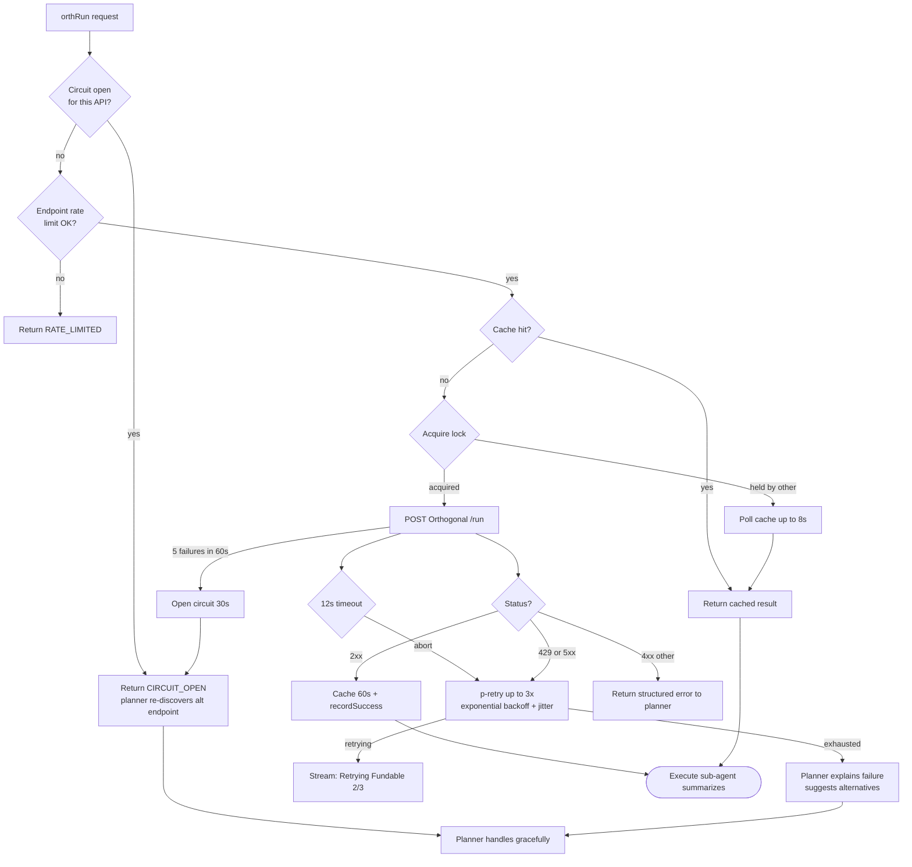

# Orthogonal Chat

**Engineering take-home:** A web-based chat application where an AI assistant calls [Orthogonal's unified API](https://orthogonal.com) and returns **real data** — company info, funding rounds, contacts, web results, and more.

| Deliverable | Link |
|-------------|------|
| **Deployed app** | [https://orthogonal-chat-rouge.vercel.app](https://orthogonal-chat-rouge.vercel.app) |
| **GitHub repo** | [https://github.com/jayavibhavnk/orthogonal](https://github.com/jayavibhavnk/orthogonal) |

**Stack:** Next.js 16 · Vercel Workflow DevKit · AI SDK v6 · Together AI · Neon Postgres (pgvector) · Upstash Redis

---

## Table of contents

1. [Approach & demo flow](#approach--demo-flow)
2. [The challenge — how we addressed it](#the-challenge--how-we-addressed-it)
3. [Architecture overview](#architecture-overview)
4. [Multi-agent design](#multi-agent-design)
5. [Context window management](#context-window-management)
6. [Artifact pattern (raw JSON vs planner context)](#artifact-pattern-raw-json-vs-planner-context)
7. [Conversation persistence & auth](#conversation-persistence--auth)
8. [System design](#system-design)
9. [Concurrent users & API deduplication](#concurrent-users--api-deduplication)
10. [Slow or down APIs — resilience](#slow-or-down-apis--resilience)
11. [Quick start](#quick-start)
12. [Deploy](#deploy)
13. [What I'd do with more time](#what-id-do-with-more-time)

---

## Approach & demo flow

Ask something like:

> List companies that recently raised a Series A in fintech

The app will:

1. **Think** — stream a plain-language plan to the UI
2. **Discover** — search Orthogonal's catalog (`/v1/search` + `/v1/details`)
3. **Execute** — run the chosen endpoint via `/v1/run` (real paid API call)
4. **Answer** — markdown tables/lists with key numbers and `requestId` sources
5. **Follow up** — suggest 4 next questions

Tool calls appear as collapsible pills in the chat (`Searched the API catalog ›`, `Called fundable /deals ›`).

### End-to-end request flow



---

## The challenge — how we addressed it

| Take-home requirement | Our solution |
|----------------------|--------------|
| **Web chat with Orthogonal APIs** | Multi-agent planner delegates to discover + execute sub-agents that call `/search`, `/details`, `/run` |
| **Real data back** | `spawn_execute` always runs live API calls; system prompt forbids hallucinated numbers |
| **Context window fills up** | 4-stage compaction + artifact storage + pgvector semantic recall |
| **Conversations persist** | Neon Postgres stores chats, messages (JSONB parts), artifacts; auth links history to users |
| **System design in README** | See [System design](#system-design) below |
| **Multiple users, same APIs** | Redis body-hash cache + single-flight lock + per-endpoint rate limits |
| **Slow or down APIs** | Retries, timeouts, circuit breaker, streamed retry UI, planner graceful degradation |
| **Deployed URL** | [orthogonal-chat-rouge.vercel.app](https://orthogonal-chat-rouge.vercel.app) |
| **GitHub repo + README** | This document |

---

## Architecture overview



### Why this shape?

- **Postgres** = durable source of truth (history, users, full API payloads)
- **Redis** = ephemeral coordination (cache, locks, rate limits) — not a primary store
- **Workflow DevKit** = long-running agent turns survive retries, tab closes, and serverless timeouts
- **Multi-agent** = planner stays lean; heavy JSON never bloats the main context

---

## Multi-agent design

Three specialized agents, orchestrated by tools:

| Agent | Model | Role |
|-------|-------|------|
| **Planner** | User-selected (default GLM-5.1) | Orchestrates tools, synthesizes final answer, streams to UI |
| **Discover** | Llama 3.3 70B | Maps user need → exact `api`, `path`, `body`, `query` via `/search` + `/details` |
| **Execute** | Llama 3.3 70B | Calls `/run`, stores raw JSON as artifact, returns short summary to planner |

### Planner tool loop

The planner is **not** limited to one tool call. It runs up to **40 steps** per user message — each step can invoke one or more tools until the question is answered.

```mermaid
flowchart TD
    Start([User message]) --> Compact[Run compactor on history]
    Compact --> Planner[Planner LLM turn]

    Planner --> Decision{What next?}

    Decision -->|Need endpoint| D[spawn_discover]
    Decision -->|Have params| E[spawn_execute]
    Decision -->|Need schema| G[get_endpoint_details]
    Decision -->|Need old data| R[read_artifact]
    Decision -->|Long chat| S[search_context]
    Decision -->|Optional UI| P[propose_plan]
    Decision -->|Done| Answer[Write final answer]
    Decision -->|Finish turn| F[generate_followups]

    D --> DiscoverAgent[Discover sub-agent<br/>Orthogonal search + details]
    E --> ExecuteAgent[Execute sub-agent<br/>Orthogonal run + artifact]

    DiscoverAgent --> Planner
    ExecuteAgent --> Planner
    G --> Planner
    R --> Planner
    S --> Planner
    P --> Planner

    Answer --> F
    F --> End([Persist + stream complete])

    style D fill:#e8f4fd
    style E fill:#e8f4fd
    style ExecuteAgent fill:#fff3cd
    style DiscoverAgent fill:#fff3cd
```



**Typical data question path:**

```
spawn_discover → spawn_execute → (read_artifact if needed) → final answer → generate_followups
```

**Complex question path (multiple APIs):**

```
spawn_discover → spawn_execute → spawn_discover → spawn_execute → read_artifact → answer → followups
```

Each `spawn_*` call runs inside a Workflow `"use step"` — durable, retriable, persisted for replay.

---

## Context window management

Both **conversation history** and **API responses** grow the context. We handle this in two layers:

1. **Artifact pattern** — prevent any single API call from dumping huge JSON into context (see next section)
2. **Progressive compaction** — shrink history as fill % increases

Compaction runs **before every planner turn** in `workflows/chat.ts`. The UI context bar (`34K / 200K · 17%`) reflects the same token estimate.

### Compaction stages



| Fill % | Stage | What happens to LLM context | User-visible history |
|--------|-------|----------------------------|----------------------|
| **< 60%** | `none` | Full history passed through | Unchanged |
| **60–75%** | `log` | Still full history; compaction snapshot artifact written to Postgres | Unchanged |
| **75–85%** | `snip` | Old `tool` role messages replaced with `[snipped — see artifact]`; last 6 messages kept intact | Unchanged |
| **≥ 85%** | `summarize` | Older turns collapsed into one `<previous_context>` system message; last 8 messages kept | Unchanged |

> **Important:** Compaction only affects what is sent to the **LLM** on the next turn. The UI still loads full message parts from Postgres.

### Summarize stage detail



**Recovery after aggressive compaction:**

| Tool | When |
|------|------|
| `read_artifact(id, jsonpath?)` | Need specific fields from stored API JSON |
| `search_context(query)` | Semantic search over past messages, artifacts, compaction notes |

Embeddings use Together `intfloat/multilingual-e5-large-instruct` (1024 dims) stored in `context_embeddings` with pgvector.

---

## Artifact pattern (raw JSON vs planner context)

Orthogonal `/run` can return hundreds of KB of JSON. Inlining that into the planner context would consume a large fraction of the window on every subsequent turn.

### Data flow



**What the planner receives from `spawn_execute`:**

```json
{
  "ok": true,
  "summary": "Found 47 Series A fintech companies. Top: Stripe ($600M)...",
  "artifact_id": "a1b2c3d4-...",
  "price_cents": 12,
  "request_id": "req_xyz789",
  "cache_hit": false,
  "latency_ms": 2340
}
```

**What the planner does NOT receive:** the raw 300KB JSON blob.

The execute sub-agent also emits an artifact chip to the UI so users can inspect stored results.

### Two-layer memory model

```
Layer 1 — Artifacts (Postgres)     → permanent full API payloads
Layer 2 — Planner context (ephemeral) → summaries + IDs, compacted over time
Layer 3 — Vector search (pgvector)  → recall facts after snip/summarize
```

---

## Conversation persistence & auth

### Persistence flow



### Schema



### Auth

- Email/password signup and login (bcrypt)
- `middleware.ts` protects `/chat/*` and API routes
- Chats linked to `user_id` — history follows you across sessions and devices
- Anonymous session cookie for pre-login chats; merged on login

Messages use AI SDK v6 `UIMessage.parts` — text, tool pills, plan cards, retry banners, artifact chips, and follow-ups all persist as typed JSONB.

---

## System design

### Database choice: Postgres + Redis

| Store | Purpose | Why this store |
|-------|---------|----------------|
| **Neon Postgres** | Chats, messages, artifacts, users, embeddings, API logs | Durable, relational, JSONB for rich message parts, pgvector for semantic search |
| **Upstash Redis** | API response cache, single-flight locks, rate limits, circuit breaker | Sub-ms KV, TTL-native, serverless HTTP API |

Postgres cannot do sub-millisecond distributed locking at scale; Redis cannot be the authoritative store for chat history. Both are serverless — zero ops overhead.

### How it scales

| Axis | Bottleneck | Mitigation |
|------|-----------|------------|
| Chat history reads | Postgres query latency | Indexed by `session_id` / `user_id` + `last_message_at`; Neon read replicas; client SWR |
| Agent compute | LLM + Orthogonal latency | Vercel Workflow scales horizontally; each chat turn is an independent workflow |
| Orthogonal cost & rate limits | Upstream quotas | Redis dedup cache, per-endpoint token bucket, circuit breaker |
| Token cost | Long conversations | Artifact pattern + 4-stage compaction |
| Embedding search | Vector query latency | pgvector IVFFlat/HNSW index on `context_embeddings` |

### Durable execution (Vercel Workflow DevKit)

Agent turns are **workflows**, not single HTTP requests:

- Sub-agent calls are `"use step"` functions — automatic retry, result persisted for replay
- Streaming decoupled from execution via `getWritable<UIMessageChunk>()`
- Client reconnects via `WorkflowChatTransport` + `/api/chat/[runId]/stream`
- Planner runs until done or `maxSteps: 40`

---

## Concurrent users & API deduplication

When many users ask the same question simultaneously, we avoid duplicate paid `/run` calls.



### Mechanisms

| Mechanism | Detail |
|-----------|--------|
| **Body-hash cache** | `sha256({ api, path, body, query })` → 60s TTL |
| **Single-flight lock** | `SET NX` with 30s TTL; losers poll cache up to 8s |
| **Session rate limit** | 60 chat POSTs/min per session |
| **Endpoint rate limit** | Fundable 30/min; Apollo & Linkup 60/min (sliding window) |

Dedup is on **identical API payloads**, not user identity — different filters or endpoints always get separate calls.

---

## Slow or down APIs — resilience



### Failure playbook

| Failure | User sees | System behavior |
|---------|-----------|-----------------|
| **429 rate limit** | `Retrying Fundable… (2/3)` banner | `p-retry` with backoff; retry event streamed to UI |
| **5xx upstream** | Same retry banner | 3 attempts, then structured error to planner |
| **Timeout (12s)** | Retry banner | `AbortController` per attempt |
| **Circuit open** | "Fundable temporarily unavailable" | Fail fast; planner runs `spawn_discover` for alternative |
| **All retries exhausted** | Partial answer + limitations | Planner explains what failed |
| **402 insufficient credits** | Error in plan card | Planner surfaces before proceeding |

---

## Quick start

```bash
cd orthogonal-chat
cp .env.example .env.local
# Fill in TOGETHER_API_KEY, ORTHOGONAL_API_KEY, DATABASE_URL, UPSTASH_REDIS_*

# Apply migrations (Neon SQL editor or psql)
psql $DATABASE_URL -f drizzle/0000_init.sql
psql $DATABASE_URL -f drizzle/0001_auth_vectors.sql
psql $DATABASE_URL -f drizzle/0002_embedding_1024.sql

npm install
npm run dev
```

Open [http://localhost:3000](http://localhost:3000) — sign up or start a chat.

Sign up for an Orthogonal API key at [orthogonal.com](https://orthogonal.com).

---

## Deploy

**Live URL:** [https://orthogonal-chat-rouge.vercel.app](https://orthogonal-chat-rouge.vercel.app)

```bash
vercel link
vercel env pull .env.local
vercel deploy --prod
```

Apply all three SQL migrations to Neon before first deploy. Set env vars in Vercel:

| Variable | Required | Description |
|----------|----------|-------------|
| `TOGETHER_API_KEY` | Yes | Together AI |
| `ORTHOGONAL_API_KEY` | Yes | Orthogonal (`orth_live_…`) |
| `DATABASE_URL` | Yes | Neon Postgres connection string |
| `UPSTASH_REDIS_REST_URL` | Recommended | Redis REST URL |
| `UPSTASH_REDIS_REST_TOKEN` | Recommended | Redis REST token |
| `AUTH_SECRET` | Recommended | Session signing secret |

Redis is optional locally (cache/rate-limit degrade gracefully) but recommended for production dedup.

Workflow DevKit routes auto-generate at `/.well-known/workflow/v1/*`.

---

## Project structure

```
app/
  api/chat/              POST agent stream, GET reconnect stream
  api/chats/             CRUD + message persistence
  api/auth/              signup, login, logout, me
  chat/[id]/             Chat page
  login/ signup/         Auth pages
components/
  chat/                  Message, ToolPill, PlanCard, FollowUps, ModelPicker, ContextBar
  sidebar.tsx
lib/
  agent/                 Planner tools, sub-agents, compactor, models, prompts
  orthogonal/            Client, cache, ratelimit, breaker
  embeddings/            pgvector store + search
  auth/                  Session + password helpers
  db/                    Drizzle schema + queries
  stream/                Data part protocol + emit helpers
workflows/
  chat.ts                Durable workflow (DurableAgent + compaction)
drizzle/
  0000_init.sql          Core schema
  0001_auth_vectors.sql  Users + pgvector
  0002_embedding_1024.sql Embedding dimension fix
```

---

## Models

Five Together AI models selectable in the UI:

| # | Model | Context | Best for |
|---|-------|---------|----------|
| 1 | GLM 5.1 | 200K | Default planner |
| 2 | Kimi K2.6 | 200K | Frontier alternative |
| 3 | MiniMax M2.7 | 200K | Best cost/performance |
| 4 | Kimi K2.5 | 256K | Deep tool loops |
| 5 | Llama 3.3 70B | 128K | Discover + execute sub-agents |

---

## What I'd do with more time

Given more time and budget, I would focus on validation, hardening, and polish rather than new surface area.

### Testing & evaluation

- **Broader model evaluation** — Run the full agent loop against more Together models (and higher API credit limits) to compare tool-calling reliability, latency, and cost per successful answer.
- **Prompt suite across domains** — Build a regression set covering Fundable, Apollo, Linkup, and edge cases: empty results, malformed filters, multi-step research, follow-up questions, and long conversations. Score pass/fail on real data, not just formatting.
- **Failure-point analysis** — Log and categorize where turns break down (discover picks wrong endpoint, execute schema errors, planner stops after planning, compaction loses key facts). Use that data to iterate on prompts and tool design.

### Infrastructure & caching

- **Redis caching, done properly** — Extend beyond the current 60s body-hash cache: tiered TTLs by endpoint cost, cache warming for common queries, explicit cache invalidation rules, and metrics on hit rate and cost saved.
- **Isolated sandboxes for execution** — Run untrusted or heavy work (API response parsing, large JSON transforms, optional code execution) in isolated sandboxes (e.g. Vercel Sandbox, E2B, or Fly Machines) instead of relying solely on the Vercel Workflow SDK for all compute. Keeps the workflow layer thin and makes failure domains clearer.

### Agent architecture & prompts

- **Architecture pass after real usage** — Refine the multi-agent split based on observed failures: e.g. separate validator agent, parallel discover+execute fan-out, or a dedicated retry/repair loop when `spawn_execute` returns schema errors.
- **System prompt polish** — Tighten planner, discover, and execute prompts with concrete examples from failed runs; add domain-specific hints per Orthogonal API; reduce ambiguous instructions that cause the planner to plan without executing.
- **Planner self-eval** — Before finishing a turn, ask the model whether the user's question was fully answered with cited data; loop back if not.

### Product & observability

- **Observability** — Langfuse (or similar) trace trees linking planner steps → sub-agents → Orthogonal calls, plus a per-chat cost dashboard.
- **Rich result tables** — TanStack Table with sort, filter, and CSV export for large API result sets.
- **Budget controls** — Per-chat daily spend cap; planner confirms before expensive calls.
- **MCP toggle** — Switch tool source between REST and `mcp.orth.sh` for side-by-side comparison.
- **OAuth / magic link** — Clerk or Auth.js alongside email/password.
- **Cross-chat memory** — User-level vector search spanning all conversations, not just the current chat.

---

## Questions?

For take-home questions: bera@orthogonal.com

Built for the Orthogonal Engineering Take-Home — deadline May 27, 2026.
